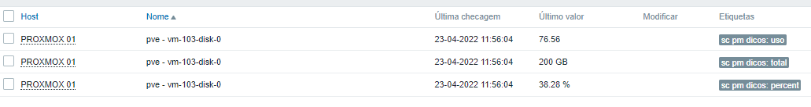
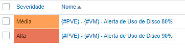

# Proxmox Monitoramento de Discos

## **[Saulo Costa - Telegram](https://t.me/saulotarsobc)**

> Monitoramento de discos das VM's com Python
>
> Lib: paramiko==2.10.3
> 


## Comandos + Parâmetros

### Via bash

```sh
script.py [proxmox ip eddress] [proxmox ssh port] [proxmox username] [proxmox password]
```

### Via Discovery

```js
proxmox_disks_ssh[{HOST.IP}, {$SSH_PORT}, {$SSH_USER}, {$SSH_PASS}]
```

## Macro

```js
{#VM} = $..vm.first()
{#PVE} = $..pve.first()
```

## JSON Path

```js
$[?(@.vm == "{#VM}" && @.pve == "{#PVE}")].total.first()
$[?(@.vm == "{#VM}" && @.pve == "{#PVE}")].uso.first()
$[?(@.vm == "{#VM}" && @.pve == "{#PVE}")].uso_percent.first()
```

## Retorno do script


## Template

### Itens



### Trigger


