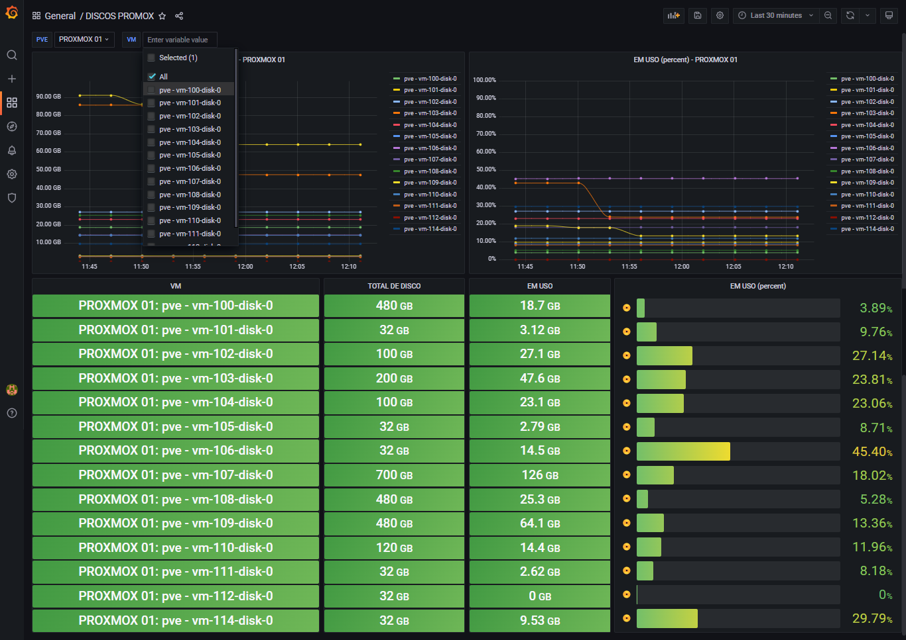

# Proxmox Monitoramento de Discos



> Monitoramento de discos das VM's com Python
>
> Lib: paramiko==2.10.3

## Comando

### Via bash

```sh
script.py [proxmox ip eddress] [proxmox ssh port] [proxmox username] [proxmox password]
```

### Via Discovery

```js
proxmox_disks_ssh[{HOST.IP}, {$SSH_PORT}, {$SSH_USER}, {$SSH_PASS}]
```

## Macro

```js
{#VM} = $..vm.first()
{#PVE} = $..pve.first()
```

## JSON Path

```js
$[?(@.vm == "{#VM}" && @.pve == "{#PVE}")].total.first()
$[?(@.vm == "{#VM}" && @.pve == "{#PVE}")].uso.first()
$[?(@.vm == "{#VM}" && @.pve == "{#PVE}")].uso_percent.first()
```


## Retorno do script

```json
[
  {
    "vm": "vm-100-disk-0",
    "pve": "pve",
    "total": 480,
    "uso": 17.14,
    "uso_percent": 3.57
  },
  {
    "vm": "vm-101-disk-0",
    "pve": "pve",
    "total": 32,
    "uso": 3.12,
    "uso_percent": 9.76
  },
  {
    "vm": "vm-102-disk-0",
    "pve": "pve",
    "total": 100,
    "uso": 27.14,
    "uso_percent": 27.14
  },
  .
  .
  .
```
